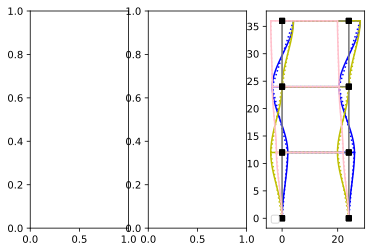

---
title: Modal Analysis - 1r
...

# Modal analysis - 1r


```python
import ema as em
import matplotlib.pyplot as plt
import numpy as np
%config InlineBackend.figure_format = 'svg'
```


```python
mdl = em.rModel(2,3)
n = mdl.dnodes
e = mdl.delems
w = 24
h = 12

mdl.frame((1,w), (3,h))

for node in n.values():
    mdl.fix(node, 'rz')
    
n['4'].mass = 1
n['6'].mass = 1
n['8'].mass = 0.5
mdl.fix(n['1'], ['x', 'y'])
mdl.fix(n['2'], ['x', 'y'])

mdl.DOF = [[10, 11, 12], [13, 14, 15], 
           [ 1, 11,  4], [ 1, 14,  5], 
           [ 2, 11,  6], [ 2, 14,  7], 
           [ 3, 11,  8], [ 3, 14,  9]]
```

## Part a)


```python
K = em.K_matrix(mdl)
M = em.Mass_matrix(mdl)
K.f*h**3
```


<table border="1" class="dataframe">
  <thead>
    <tr style="text-align: right;">
      <th></th>
      <th>0</th>
      <th>1</th>
      <th>2</th>
    </tr>
  </thead>
  <tbody>
    <tr>
      <th>0</th>
      <td>48.0</td>
      <td>-24.0</td>
      <td>0.0</td>
    </tr>
    <tr>
      <th>1</th>
      <td>-24.0</td>
      <td>48.0</td>
      <td>-24.0</td>
    </tr>
    <tr>
      <th>2</th>
      <td>0.0</td>
      <td>-24.0</td>
      <td>24.0</td>
    </tr>
  </tbody>
</table>


```python
M.f
```


<table border="1" class="dataframe">
  <thead>
    <tr style="text-align: right;">
      <th></th>
      <th>$u_{{1}}$</th>
      <th>$u_{{2}}$</th>
      <th>$u_{{3}}$</th>
    </tr>
  </thead>
  <tbody>
    <tr>
      <th>$u_{{1}}$</th>
      <td>1.0</td>
      <td>0.0</td>
      <td>0.0</td>
    </tr>
    <tr>
      <th>$u_{{2}}$</th>
      <td>0.0</td>
      <td>1.0</td>
      <td>0.0</td>
    </tr>
    <tr>
      <th>$u_{{3}}$</th>
      <td>0.0</td>
      <td>0.0</td>
      <td>0.5</td>
    </tr>
  </tbody>
</table>


## Part b)


```python
shapes = em.analysis.ModalAnalysis(mdl)
```


```python
shapes
```


    (array([0.05183404+0.j, 0.02777778+0.j, 0.00372152+0.j]),
     array([[ 4.08248290e-01, -8.16496581e-01, -4.08248290e-01],
            [-7.07106781e-01, -3.10316769e-16, -7.07106781e-01],
            [ 8.16496581e-01,  8.16496581e-01, -8.16496581e-01]]))


```python
U = em.U_vector(em.A_matrix(mdl))
```


```python
colors = ['b', 'y','pink']
fig, ax = plt.subplots(1,3)
for i, shape in enumerate(shapes[1].T):
    U[0:3] = shape
    em.plot_modes(mdl, U, ax[i], color=colors[i], label=str(i+1))
plt.legend();
```

    No handles with labels found to put in legend.
    





## Part c) Verify orthogonality


```python
phis = np.around(shapes[1], 7)
phis
```


    array([[ 0.4082483, -0.8164966, -0.4082483],
           [-0.7071068, -0.       , -0.7071068],
           [ 0.8164966,  0.8164966, -0.8164966]])


```python
print(phis[:,0] @ M.f @ phis[:,1])
```

    0.0
    


```python
print(phis[:,0] @ M.f @ phis[:,2])
```

    3.2475700462164525e-09
    


```python
print(phis[:,1] @ M.f @ phis[:,2])
```

    0.0
    

## Part d) Normalize modes.

Each mode shape is normalized so that when multiplied by the problem variable, $\frac{1}{\sqrt{m}}$, they will generate a modal mass matrix, $M_n$, equal to the identity matrix.


```python
phi_n = np.zeros((3,3))
phi_n[:,0] = phis[:,0]/((phis[:,0] @ M.f @ phis[:,0]))**(1/2)
print(phi_n[:,0])
phi_n[:,0].T @ M.f @ phi_n[:,0]
```

    [ 0.40824829 -0.70710678  0.81649658]
    

    C:\Users\claud\Anaconda3\lib\site-packages\IPython\core\formatters.py:371: FormatterWarning: text/html formatter returned invalid type <class 'ema.utilities.Structural_Vector'> (expected <class 'str'>) for object: Structural_Vector(1.)
      FormatterWarning
    


    Structural_Vector(1.)


```python
phi_n[:,1] = phis[:,1]/((phis[:,1] @ M.f @ phis[:,1]))**(1/2)
print(phi_n[:,1])
phi_n[:,1].T @ M.f @ phi_n[:,1]
```

    [-0.81649658 -0.          0.81649658]
    


    Structural_Vector(1.)


```python
phi_n[:,2] = phis[:,2]/((phis[:,2] @ M.f @ phis[:,2]))**(1/2)
print(phi_n[:,2])
phi_n[:,2].T @ M.f @ phi_n[:,2]
```

    [-0.40824829 -0.70710678 -0.81649658]
    


    Structural_Vector(1.)


```python
Id = np.around(phi_n.T @ M.f @ phi_n,7)
Id
```


    array([[ 1.,  0.,  0.],
           [ 0.,  1., -0.],
           [ 0., -0.,  1.]])


