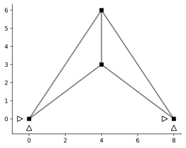

# Hyperstatic Truss - Compatibility


```python
import ema as em
import matplotlib.pyplot as plt
import numpy as np
%config InlineBackend.figure_format = 'svg'
```


```python
mdl = em.Model(2,2)
n = mdl.dnodes
e = mdl.delems

mdl.node('1', 0.0, 0.0)
mdl.node('2', 8.0, 0.0)
mdl.node('3', 4.0, 3.0)
mdl.node('4', 4.0, 6.0)

mdl.truss('a', n['1'], n['3'])
mdl.truss('b', n['2'], n['3'])
mdl.truss('c', n['1'], n['4'])
mdl.truss('d', n['3'], n['4'])
mdl.truss('e', n['2'], n['4'])

mdl.fix(n['1'], ['x', 'y'])
mdl.fix(n['2'], ['x', 'y'])

mdl.numDOF()
```


    [[5, 6], [7, 8], [1, 2], [3, 4]]


```python
fig1, ax1 = plt.subplots(1,1)
em.plot_structure(mdl, ax1)
```





## Part 1
### Static-Kinematic Matrix Equivalence

$$V = A_f U_f$$


```python
A = em.A_matrix(mdl)
B = em.B_matrix(mdl)
```

$$P_f = B_f Q$$


```python
B.f
```


<table border="1" class="dataframe">
  <thead>
    <tr style="text-align: right;">
      <th></th>
      <th>$a_1$</th>
      <th>$b_1$</th>
      <th>$c_1$</th>
      <th>$d_1$</th>
      <th>$e_1$</th>
    </tr>
  </thead>
  <tbody>
    <tr>
      <th>$1$</th>
      <td>0.8</td>
      <td>-0.8</td>
      <td>0.00000</td>
      <td>-0.0</td>
      <td>0.00000</td>
    </tr>
    <tr>
      <th>$2$</th>
      <td>0.6</td>
      <td>0.6</td>
      <td>0.00000</td>
      <td>-1.0</td>
      <td>0.00000</td>
    </tr>
    <tr>
      <th>$3$</th>
      <td>0.0</td>
      <td>0.0</td>
      <td>0.55470</td>
      <td>0.0</td>
      <td>-0.55470</td>
    </tr>
    <tr>
      <th>$4$</th>
      <td>0.0</td>
      <td>0.0</td>
      <td>0.83205</td>
      <td>1.0</td>
      <td>0.83205</td>
    </tr>
  </tbody>
</table>


```python
B.f.T - A.f
```


<table border="1" class="dataframe">
  <thead>
    <tr style="text-align: right;">
      <th></th>
      <th>0</th>
      <th>1</th>
      <th>2</th>
      <th>3</th>
    </tr>
  </thead>
  <tbody>
    <tr>
      <th>0</th>
      <td>0.0</td>
      <td>0.0</td>
      <td>0.0</td>
      <td>0.0</td>
    </tr>
    <tr>
      <th>1</th>
      <td>0.0</td>
      <td>0.0</td>
      <td>0.0</td>
      <td>0.0</td>
    </tr>
    <tr>
      <th>2</th>
      <td>0.0</td>
      <td>0.0</td>
      <td>0.0</td>
      <td>0.0</td>
    </tr>
    <tr>
      <th>3</th>
      <td>0.0</td>
      <td>0.0</td>
      <td>0.0</td>
      <td>0.0</td>
    </tr>
    <tr>
      <th>4</th>
      <td>0.0</td>
      <td>0.0</td>
      <td>0.0</td>
      <td>0.0</td>
    </tr>
  </tbody>
</table>


## Part 2

### Member d length
The kinematic matrix, $A_f$, is given below:


```python
A.f
```


<table border="1" class="dataframe">
  <thead>
    <tr style="text-align: right;">
      <th></th>
      <th>$1$</th>
      <th>$2$</th>
      <th>$3$</th>
      <th>$4$</th>
    </tr>
  </thead>
  <tbody>
    <tr>
      <th>$a_1$</th>
      <td>0.8</td>
      <td>0.6</td>
      <td>0.0000</td>
      <td>0.00000</td>
    </tr>
    <tr>
      <th>$b_1$</th>
      <td>-0.8</td>
      <td>0.6</td>
      <td>0.0000</td>
      <td>0.00000</td>
    </tr>
    <tr>
      <th>$c_1$</th>
      <td>0.0</td>
      <td>0.0</td>
      <td>0.5547</td>
      <td>0.83205</td>
    </tr>
    <tr>
      <th>$d_1$</th>
      <td>-0.0</td>
      <td>-1.0</td>
      <td>0.0000</td>
      <td>1.00000</td>
    </tr>
    <tr>
      <th>$e_1$</th>
      <td>0.0</td>
      <td>0.0</td>
      <td>-0.5547</td>
      <td>0.83205</td>
    </tr>
  </tbody>
</table>


And the corresponding deformation vector is:


```python
V = em.V_vector(A)
V.set_item('b_1', 0.1)
V.set_item('c_1', 0.2)
V
```


<table border="1" class="dataframe">
  <thead>
    <tr style="text-align: right;">
      <th></th>
      <th>$V_{{}}$</th>
    </tr>
  </thead>
  <tbody>
    <tr>
      <th>$a_1$</th>
      <td>0.0</td>
    </tr>
    <tr>
      <th>$b_1$</th>
      <td>0.1</td>
    </tr>
    <tr>
      <th>$c_1$</th>
      <td>0.2</td>
    </tr>
    <tr>
      <th>$d_1$</th>
      <td>0.0</td>
    </tr>
    <tr>
      <th>$e_1$</th>
      <td>0.0</td>
    </tr>
  </tbody>
</table>


The free dof displacement vector, $U_f$, is then computed as follows:
$$
U_f = A_f^{-1}V_\epsilon
$$


```python
Ve = V[[0,1,2,4]]
Ae = A.f[[0,1,2,4],:]
U = Ae.inv@Ve
U.disp
```


$$\left[\begin{matrix}-0.0625\\0.0833333333333333\\0.180277563773199\\0.120185042515466\end{matrix}\right]$$


Finally the fully deformation vector is computed from $V=A_fU_f$, which gives the necessary deformation of element d. 


```python
Veh = A.f@U
Veh.disp
```


$$\left[\begin{matrix}9.25185853854297 \cdot 10^{-19}\\0.1\\0.2\\0.036851709182133\\1.66986849470959 \cdot 10^{-17}\end{matrix}\right]$$


Element d must therefore elongated by **0.037**.

### Satisfy Compatibility

The matrix $\bar{B}_x$ is computed as follows:


```python
mdl.redundant(e['d'], '1')
B.barx
```


<table border="1" class="dataframe">
  <thead>
    <tr style="text-align: right;">
      <th></th>
      <th>$d_1$</th>
    </tr>
  </thead>
  <tbody>
    <tr>
      <th>$a_1$</th>
      <td>0.833333</td>
    </tr>
    <tr>
      <th>$b_1$</th>
      <td>0.833333</td>
    </tr>
    <tr>
      <th>$c_1$</th>
      <td>-0.600925</td>
    </tr>
    <tr>
      <th>$d_1$</th>
      <td>1.000000</td>
    </tr>
    <tr>
      <th>$e_1$</th>
      <td>-0.600925</td>
    </tr>
  </tbody>
</table>


This is multiplied by the deformation vector as follows:


```python
residual = B.barx.T@Veh
print(residual)
if residual < 10e-9:
    print("Compatibility is satisfied")

```


```python
B.f.ker/-0.56694671
```


```python
B.ker/-0.56694671
```


```python

```
